# PawPal+ (Module 2 Project)

PawPal+ is a pet care scheduler built with Python and Streamlit. It helps an owner manage multiple pets, organize care tasks, detect scheduling problems, and regenerate recurring tasks.

## Features

### Required features
- Object-oriented design with four core classes: `Owner`, `Pet`, `Task`, and `Scheduler`
- Task management with due date, due time, completion status, frequency, and priority
- Multi-pet scheduling through a central `Scheduler`
- Algorithmic task sorting across pets
- Algorithmic filtering across pets by pet name, completion status, and priority
- Conflict detection for tasks scheduled at the exact same date and time
- CLI demo in `main.py`
- Automated pytest suite in `tests/test_pawpal.py`

### Stretch features implemented
- **Advanced algorithmic capability:** `next_available_slot()` finds the next open planning window for a new task
- **Data persistence:** `Owner.save_to_json()` and `Owner.load_from_json()` store pets and tasks in `data.json`
- **Advanced scheduling logic:** priority-based sorting orders tasks by urgency before time
- **Professional formatting:** emoji-based priority/status formatting improves the CLI and Streamlit output

## System architecture

### Mermaid UML

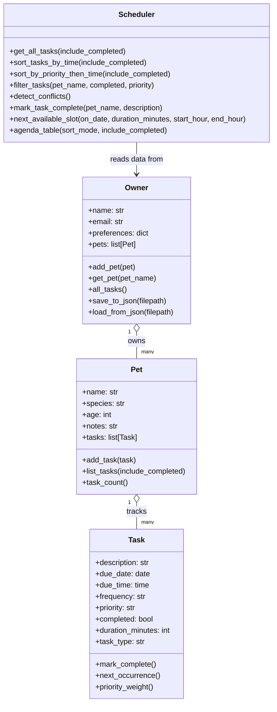

A standalone Mermaid file is also included as `uml_final.mmd`.

## Class summary

### `Task`
Represents one care activity. Each task stores:
- description
- due date
- due time
- frequency (`once`, `daily`, `weekly`)
- priority (`low`, `medium`, `high`)
- completion status
- duration
- task type

Important methods:
- `mark_complete()`
- `next_occurrence()`
- `priority_weight()`

### `Pet`
Represents one pet and the list of tasks assigned to it.

Important methods:
- `add_task()`
- `list_tasks()`
- `task_count()`

### `Owner`
Represents the owner and stores the list of pets.

Important methods:
- `add_pet()`
- `get_pet()`
- `all_tasks()`
- `save_to_json()`
- `load_from_json()`

### `Scheduler`
Acts as the logic layer for the system.

Important methods:
- `sort_tasks_by_time()`
- `sort_by_priority_then_time()`
- `filter_tasks()`
- `detect_conflicts()`
- `mark_task_complete()`
- `next_available_slot()`
- `agenda_table()`

## Smarter scheduling

PawPal+ includes multiple algorithmic features that operate across more than one pet:

1. **Chronological sorting**
   - Orders all tasks by date/time, even when they belong to different pets.

2. **Filtering across pets**
   - Can filter tasks by pet name, completion status, or priority.

3. **Conflict detection**
   - Flags tasks that occur at the exact same start time.
   - This is intentionally lightweight: it warns the user instead of blocking the schedule.

4. **Recurring task regeneration**
   - Completing a daily or weekly task automatically creates the next occurrence.

5. **Priority-first scheduling**
   - Orders high-priority tasks before medium and low priority tasks.

6. **Next available slot finder**
   - Suggests the next open time window for a new task in the current day.

## How Agent Mode / AI assistance influenced the implementation

AI assistance was used to accelerate the design and implementation workflow in four main areas:
- brainstorming the class responsibilities and relationships
- turning the class design into Python dataclasses and methods
- refining scheduling algorithms into smaller, testable methods
- expanding the project into multi-file changes for the Streamlit UI, persistence layer, and automated tests

The most useful AI contributions were structural suggestions: keeping `Scheduler` as a coordination layer instead of overloading `Owner`, and separating recurring-task logic into `Task.next_occurrence()` so the system stayed modular.

One AI-style suggestion that was deliberately simplified was conflict detection. A more complex overlapping-duration algorithm was possible, but this project keeps conflict warnings based on exact matching start times to preserve readability and make behavior easy to test.

## Running the project

### Setup

```bash
python -m venv .venv
source .venv/bin/activate  # Windows: .venv\Scripts\activate
pip install -r requirements.txt
```

### Run the CLI demo

```bash
python main.py
```

This demo creates:
- 1 owner
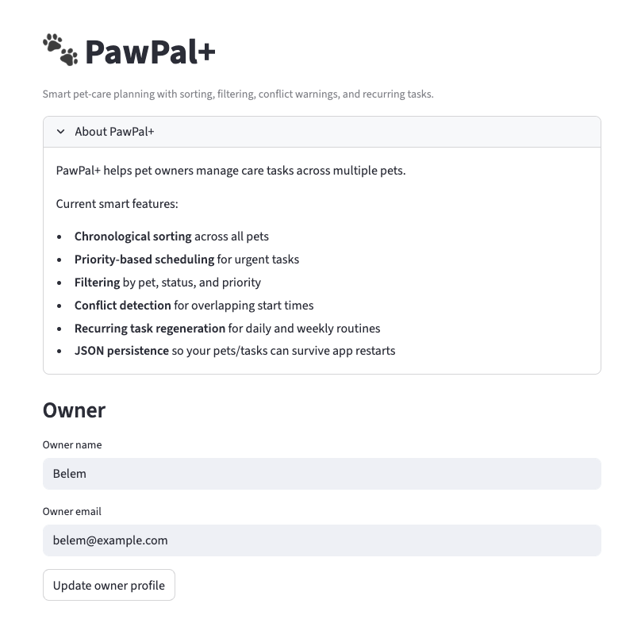
- 2 pets
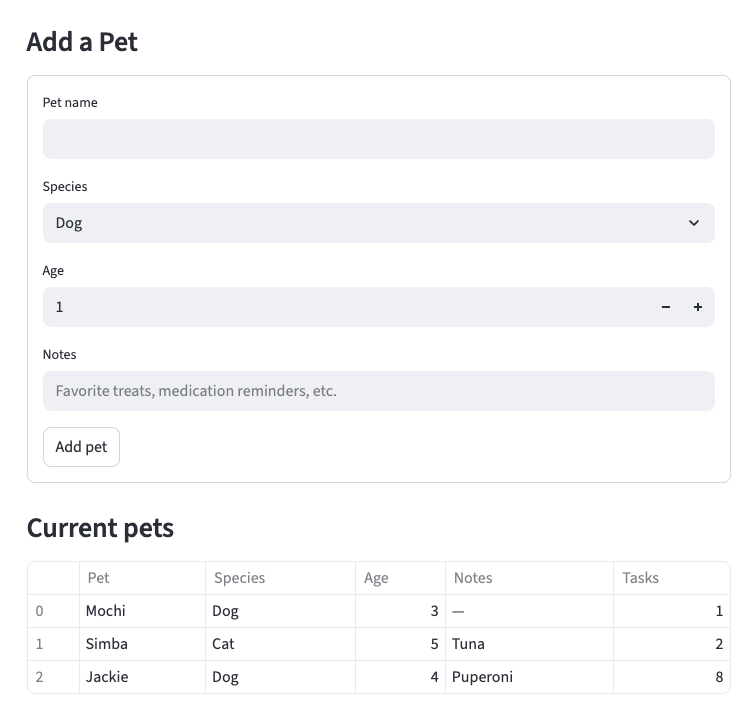
- 4 tasks
- a schedule sorted by time
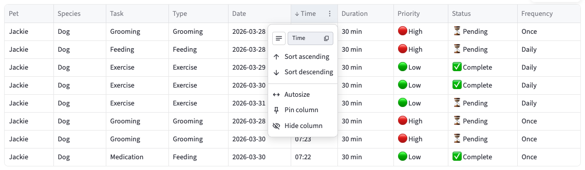
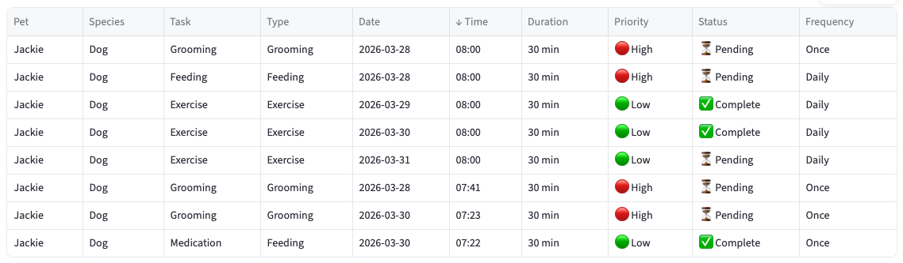
- a schedule sorted by priority
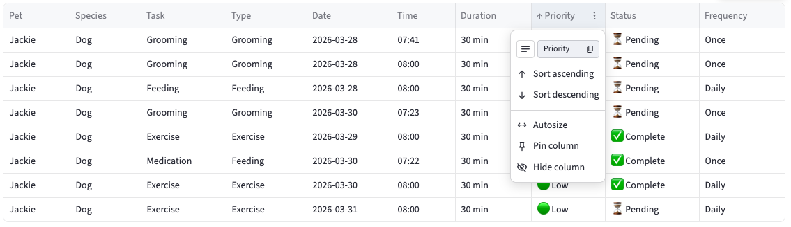
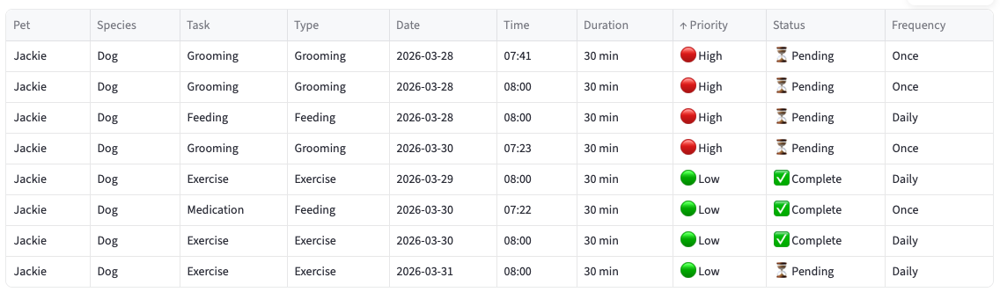
- filtered output
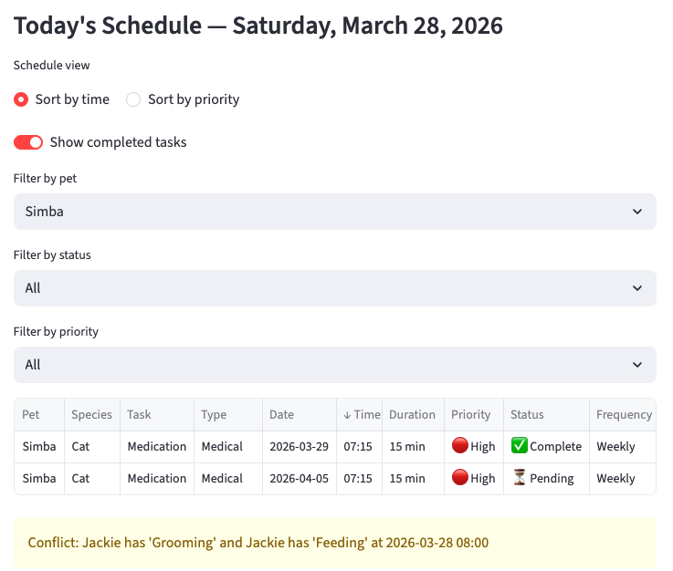
- conflict detection output
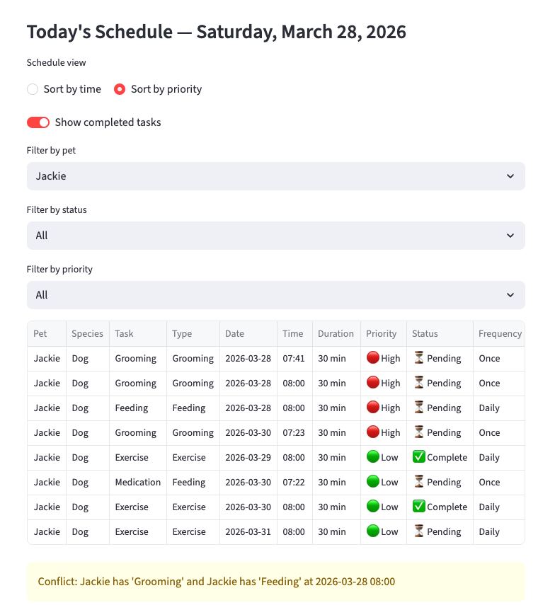
- recurring-task regeneration
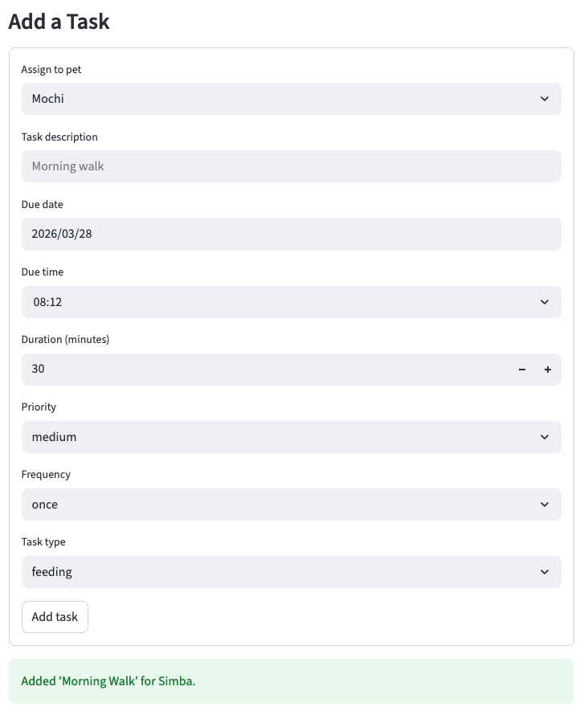
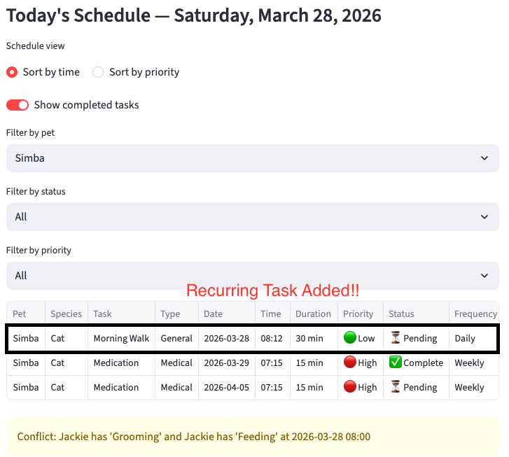
- next available slot output
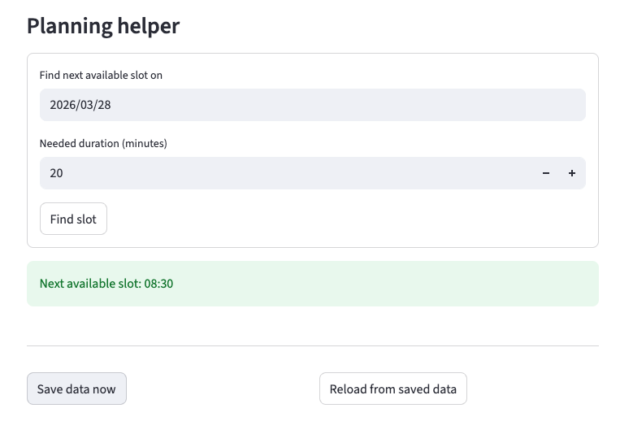

### Run the Streamlit app

```bash
streamlit run app.py
```

### Run the tests

```bash
python -m pytest
```

## Testing PawPal+

The test suite verifies the following behaviors:
- completing a task updates its status
- adding a task increases a pet's task count
- chronological sorting is correct
- daily recurrence creates the next day's task
- conflict detection flags duplicate start times
- next available slot skips already booked task windows

## Project files

- `pawpal_system.py` — core OOP logic layer
- `main.py` — CLI demo script
- `app.py` — Streamlit user interface
- `tests/test_pawpal.py` — pytest suite
- `uml_final.mmd` — Mermaid UML diagram
- `reflection.md` — project reflection draft
- `requirements.txt` — dependencies
