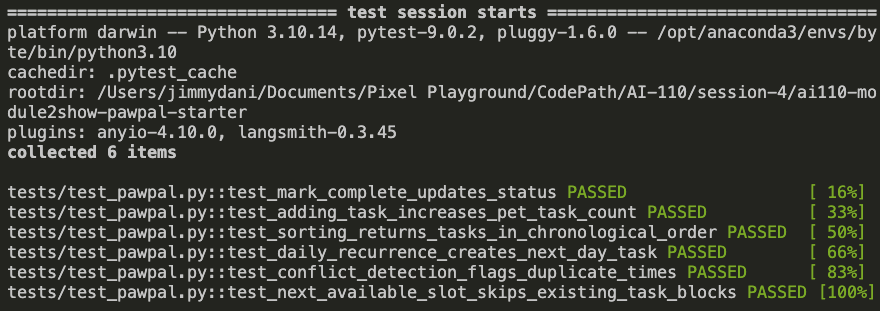

# PawPal+ Project Reflection

## 1. System Design

**a. Initial design**

- Briefly describe your initial UML design.
- What classes did you include, and what responsibilities did you assign to each?

Response: My initial UML design had four main classes: Owner, Pet, Task, and Scheduler.

- Owner: It stores the identifying information and manages a list of tasks
- Pet: It stores identifying details for an individual animal and a list of tasks assigned to that pet.
- Task: It represents a single care activity, including description, due date, due time, completion status, frequency, duration, and priority.
- Scheduler: It acts as the coordination layer that retrieves tasks across pets and applied algorithmic logic like sorting, filtering, conflict detection, and recurring-task handling.

This approach keeps the data separate from the scheduling behavior. 

> **Note:** I manually came up with the design first and then used Claude to enhance the UML diagram.

**b. Design changes**

- Did your design change during implementation?
- If yes, describe at least one change and why you made it.

Response: I have changed the design of the system during implementation.

I changed the approach to keep the scheduling logic or scheduling algorithms in the Scheduler. The Pet and Owner only stores data, and the Scheduler is responsible for organizing and evaluating the task.

To improve modularity and keep the recurring-task easy to manage, I added JSON persistence methods to Owner and a helper function `next_occurrence()` to Task. 

---

## 2. Scheduling Logic and Tradeoffs

**a. Constraints and priorities**

- What constraints does your scheduler consider (for example: time, priority, preferences)?
- How did you decide which constraints mattered most?

Response: Following constraints were considered by the scheduler:
    - task priority
    - due date and due time
    - completion status
    - pet name when filtering
    - recurrence rules for daily and weekly tasks

I considered due time and priority as the most important constraints because a pet owner usually nneds to know both "what is urgent" and "what is due soon". That is why I implemented both chronological sorting and priority-based sorting.

**b. Tradeoffs**

- Describe one tradeoff your scheduler makes.
- Why is that tradeoff reasonable for this scenario?

Response: My current scheduler only checks for exact matching start times instead of full overlapping time blocks. I believe this trade-off is reasonable because it keeps the logic lightweight, easy to explain and test. 

---

## 3. AI Collaboration

**a. How you used AI**

- How did you use AI tools during this project (for example: design brainstorming, debugging, refactoring)?
- What kinds of prompts or questions were most helpful?

Response: I used AI as follows:
- brainstorming the class responsibilities and their relationships
- turning the UML design into Python dataclasses and methods
- designing modular scheduler for easier debugging and testing
- generating and reviewing test ideas for sorting, recurrence, and conflict detection
- planning the phases of the project and changes needed to connect Streamlit with backend

The prompts that included details like name of the file, method to focus on (e.g., Scheduler) and some examples on how the scheduler should work were most helpful in steering the output of the AI models or getting meaningful and easy to follow output.

**b. Judgment and verification**

- Describe one moment where you did not accept an AI suggestion as-is.
- How did you evaluate or verify what the AI suggested?

I did not accept every AI-suggestion as it was overengineering the implementation. This introduces complexity in the code making debugging and testing difficult. For example, while developing schduler, AI provided sophisticated conflict-detection approachbased on duration overlap that added extra complexity. I decided to keep a simpler time-based warning because it matches the project scope.

I verified the correctness of the AI-assisted code by running the commandline demo, reviewing output manually on custom test cases, and using the pytest to confirm the key behaviros worked as expected.

---

## 4. Testing and Verification

**a. What you tested**

- What behaviors did you test?
- Why were these tests important?

Response: I evaluted core functionality of the system:
- marking a task complete changes its status
- adding a task increases a pet's task count
- chronological sorting returns tasks in the correct order
- completing a daily task creates a new task for the following day
- conflict detection flags duplicate times
- next available slot finds an open time after existing scheduled tasks

**b. Confidence**

- How confident are you that your scheduler works correctly?
- What edge cases would you test next if you had more time?

Response: I am confident that scheduler works correctly for the main requirements of the project because automated tests pass and the CLI demo shows the expected workflow.

In future, I would test more edge cases such as:
- pets with no tasks
- invalid task inputs
- weekly recurrence in more detail
- conflicts involving overlapping durations instead of exact matching times only
- persistence behavior when loading partially complete datasets

---

## 5. Reflection

**a. What went well**

- What part of this project are you most satisfied with?

Response: In was satisfied withthe separation of responsibilities between the data classes and the scheduler. That structure made the code easier to build, extend, and test.

**b. What you would improve**

- If you had another iteration, what would you improve or redesign?

Response: I would improve the conflict detection logic to incorporate for duration overlap and build more editing features into Streamlit UI, such as enable drag-and-drop to reschedule and updating details of existing pets and owners.

**c. Key takeaway**

- What is one important thing you learned about designing systems or working with AI on this project?

Response: I believe it is important to lead and while working with AI. When I directly asked AI to work on this project for me the code generated was overengineered and was difficult to read, follow, debug, and test. However, when I took the lead and and guided AI appropriately with manually designed UML, test cases, and examples, it was easy to enhance the design and follow the code generated by the AI model. However, I'm still trying to come up with effective way to verify the final system output (e.g., is the system vulnerable to attack from malicious actors, etc.)